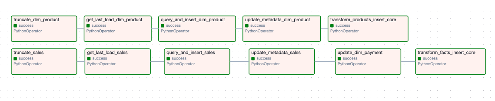
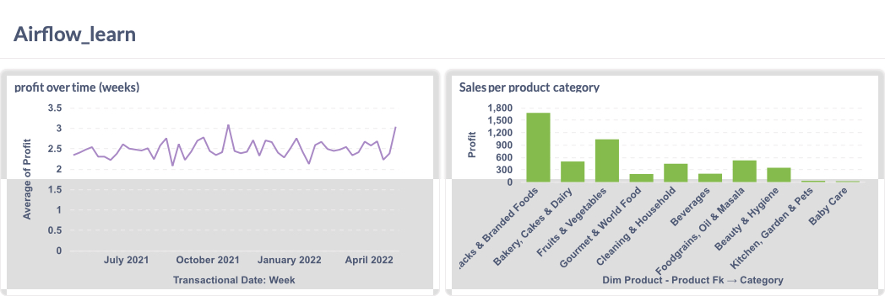

# Airflow Data Pipeline

This project is an Apache Airflow implementation of the data pipeline introduced in the [Data Warehouse: The Ultimate Guide](https://www.udemy.com/course/data-warehouse-the-ultimate-guide/?couponCode=ST7MT290425G2) Udemy course. (Course uses Pentaho).

Key difference in my implementation: I introduced a metadata table to document last upload values for each core table. Does not require a lot of storage space, reliable, and better for Airflow.

## Key Aspects

-   Utilizes a star schema data model.
-   Orchestrated with Apache Airflow.
-   Implements ETL for structured data.
-   Focuses on incremental updates via delta extraction.
-   Integrates with PostgreSQL.

The Airflow DAG:

____

I connected the PostgreSQL database to Metabase, to create a data analysis dashboard.

